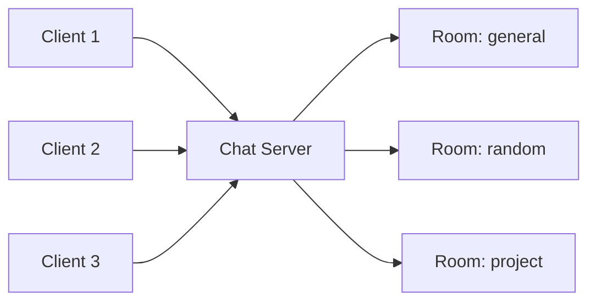

# System Architecture Design

## Overview
This project implements a real-time messaging application using Python socket programming over TCP.  
The system follows a client-server architecture where one central server manages users, rooms, invitations, and message forwarding.

## Architecture Diagram

## Main Components

### 1. Client
The client is a console-based program.  
It connects to the server, registers a unique username, sends user commands, and receives messages in real time.

### 2. Server
The server is the central controller of the application.  
It accepts multiple socket connections, validates usernames, manages chat rooms, processes invitations, and broadcasts room-based messages.

### 3. Rooms
Rooms are logical groups of connected users.  
Each user belongs to one active room at a time, and messages are broadcast only inside that room.

### 4. Protocol Layer
The application protocol uses newline-delimited JSON messages.  
This makes the protocol easy to read, debug, and explain during the demo.

## Why Client-Server Architecture Was Chosen
Client-server architecture was selected because it is simpler to implement and manage than peer-to-peer communication.  
It also makes room handling, username uniqueness, message broadcasting, and logging easier to control from one place.

## Advantages
- Easier room and user management
- Centralized control of invitations and message routing
- Easier debugging and logging
- Easier live demonstration

## Disadvantages
- The server is a single point of failure
- All communication depends on the server being active