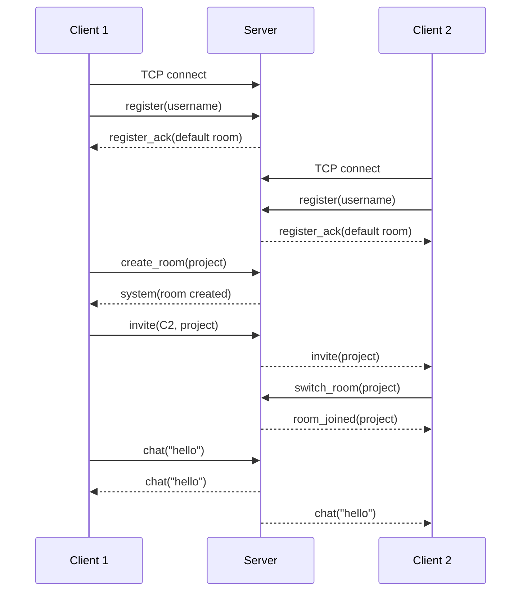

# Network Communication Flow

## Overview
The communication flow begins when a client connects to the server using a TCP socket.  
After registration, the server assigns the user to a default room and handles all later room operations and chat forwarding.

## Sequence Diagram

## Text Description
1. A client connects to the server over TCP.
2. The client sends a registration message with a unique username.
3. The server validates the username and places the user into a default room.
4. A user may create a new room.
5. A user may invite another user to that room.
6. The invited user can switch into the room.
7. Any chat message is sent to the server.
8. The server forwards that message to all users currently in the same room.
9. When a user disconnects, the server removes the user from internal data structures and informs the room.

## Important Note
The server acts as the single coordination point for all communication.  
This means clients do not communicate directly with each other.